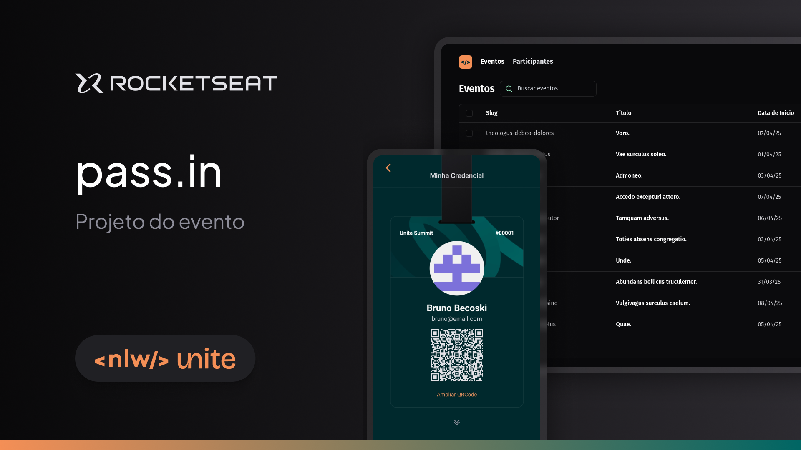

  <a href="https://github.com/BrunoBecoski/nlw-unite-pass-in-web">Web</a> 
  &nbsp; | &nbsp;
  <a href="https://github.com/BrunoBecoski/nlw-unite-pass-in-server">Server</a>
  &nbsp; | &nbsp;
  <a href="https://github.com/BrunoBecoski/nlw-unite-pass-in-mobile">Mobile</a>

  <h2>pass.in é uma aplicação de <i>gestão de participantes e eventos</i>.</h2>

## Principais Tecnologias

- [Node.js](https://nodejs.org)
- [TypeScript](https://www.typescriptlang.org)
- [Fastify](https://fastify.dev)
- [Prisma](https://www.prisma.io)
- [SQLite](https://sqlite.org)

## Diagrama
  
